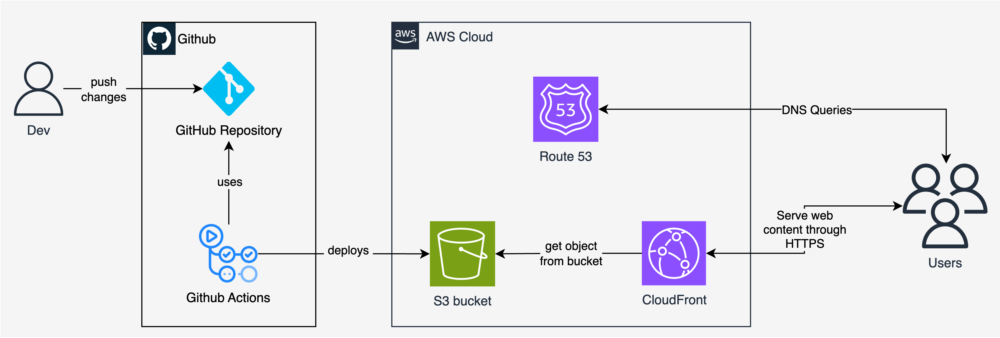

# Diego's Personal Blog

This repository contains the source code for my personal blog, built with [Hugo](https://gohugo.io/) and deployed on AWS.

[](https://github.com/diegocarba99/blog/actions/workflows/main.yml)

## 🚀 Getting Started

This project uses a `Makefile` to simplify common tasks.

### Prerequisites

- **Hugo**: The static site generator.
- **macOS**: The `install-dev-mac` command uses [Homebrew](https://brew.sh/). For other operating systems, please install Hugo manually.

### 1. Install Dependencies

Install Hugo and the testing dependencies by running:

```sh
make install-dev-mac
```

### 2. Run Locally

To start the local development server:

```sh
make deploy-local
```

You can now view the blog at `http://localhost:1313`. The site will automatically reload when you make changes to the content.

## ✍️ Creating a New Post

To create a new blog post, use the standard Hugo command:

```sh
hugo new content posts/YYYY-MM-DD-your-post-title.md
```

This will create a new Markdown file in the `content/posts/` directory with the basic front matter.


## ☁️ Deployment Architecture

This blog is automatically built and deployed using GitHub Actions.

- **Hugo** builds the static HTML, CSS, and JS files.
- **GitHub Actions** runs on every push to the `main` branch to build the site and deploy it.
- **Amazon S3** hosts the static website content.
- **Amazon CloudFront** serves as the CDN to distribute the content globally over HTTPS.



## 📝 To-Do

- [ ] Create an RSS feed for the blog.
- [ ] Update my GitHub profile README to list recent blog posts.